# Heart_Disease_Predicition_NATHANPHILIPB
My Machine learning project on Heart Disease Prediction during my internship at Diginique Techlabs remotely with iHUB DivyaSampark at IIT Roorkee.

**A PROJECT REPORT**

**ON**

**HEART DISEASE PREDICTION USING MACHINE LEARNING ALGORITHMS**

Submitted in partial fulfilment of the requirement for the award of TRAINING

IN

Data Analytics, Machine Learning and AI using Python

*Submitted By*

**Nathan Philip Bulla (**Vellore Institute of Technology, Amaravati**)** *Under the guidance of*

**Ashish Saini**

**ACKNOWLEDGEMENT**

My sincere gratitude and thanks towards the Diginique team, for providing proper guidance, direction and accessible resources and active help for the development of this project.

**ABSTRACT**

Various Machine Learning techniques were used to predict Heart disease, trained on the Heart disease dataset. Preprocessing involved balancing and normalising the data, followed by a 4:1 Train-test split. The algorithms used were KNN, SVM, Random Forest, Logistic Regression, and AdaBoost using Decision trees. The best performing model was the Adaboost classifier, which achieved an accuracy of 90.74% on the testing dataset.

1. **INTRODUCTION**

One of the leading causes of death in adults is Heart disease, more specifically, Coronary Artery Disease.

This project aims at exploring different machine learning techniques to help create a system for the automatic diagnosis or prediction of heart disease, given a patient’s medical data.

The project explores algorithms such as Logistic regression, K-Nearest Neighbours, Support vector Machine, Random Forests, AdaBoost.

The dataset used for this particular set of experiments is a subset of the University of California Irvine’s Machine Learning Repository’s Heart Disease Dataset [1], compiled by the user Rishi Damarla on Kaggle [2].

**1.1. Problem statement**

The dataset contains 14 columns, containing the key features required to predict the presence or absence of heart disease, and the task is to utilise machine learning to achieve a satisfactory performance in the task of binary classification on the procured structured data.

2. **METHODOLOGIES**
1. **Machine Learning**

Machine learning is the subset of data science that deals with developing mathematical, statistical and predictive models that can be trained on certain data, such that they are able to predict the outcomes on new unseen data.

It has a near infinite number of uses in technology, intelligence, development, research, and

engineering solutions.

There are mainly two pathways of machine learning, separated based on the type of data being dealt with:

- *Supervised Learning: when the target output is known.*
- *Unsupervised Learning: when the target output is not known*

Machine learning is a family of techniques that are chiefly used for training on Structured data. Deep learning methods can also be used in case the volume of data is larger, or if the machine learning algorithms fail to learn properly.

includes three types of layers: an input layer, one or more hidden layers and an output layer. The input layer usually merely passes data along without modifying it. Most of the computation happens in the hidden layers. The output layer converts the hidden layer activations to an output, such as a classification. A multilayer feed-forward network with at least one hidden layer can function as a universal approximator.

2. **Dataset**

The dataset used is a subset of the UCI machine learning repository’s Heart Disease dataset [1]. It was sourced from Kaggle, contributed by the user Rishi Damarla [2].

The dataset has 270 entries, with 14 features (Age, Sex, Chest pain type, Blood pressure, Cholesterol, FBS over 120, EKG results, Max Heart rate, Exercise Angina, ST depression, Slope of ST, Number of vessels fluro, Thallium, Heart disease presence) , with the target column (Heart disease presence) having values of either ‘Presence’ or ‘Absence’.

3. **Preprocessing**
1. **Check Missing/null values**

To reduce impurities, we will find and handle all the missing values in the dataset.

This can be done in many ways, such as Row-wise Mean (finding mean of preceding/succeeding values), column-wise mean (replacing the missing value with the mean value of the entire column), omitting the row, etc.As the dataset in question has no missing values, we proceed with the next steps.

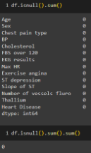

Fig. 1 showing that there are no missing values in any column

2. **Train Test Split**

This technique consists of dividing the whole dataset into subsets of Train and Test, which will be used for Training and Testing the models respectively. It is one of the most fundamental steps in ML, which can help simulate the performance of the models created on unseen data, satisfied by evaluating the performance of the model on the testing dataset.

In this project, we have used a ratio of 0.2, meaning 80% of data considered as Training, and 20% for testing. i.e 216 rows for training, 54 for testing.

3. **Balance**

Balance of the dataset refers to the distribution of the target class values across the dataset. Ideally, the count for each class must be equal, i.e. a weight of 1 for each class.

But in the chosen dataset, we encounter an imbalance.

The target class (Heart Disease) has two values: Presence (1), and Absence (0), with respective counts as 120 and 150.

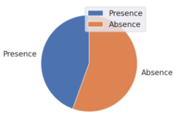

**Fig.2** Target Class distribution

This can be tackled in many ways:

*Upsampling*: Refers to increasing the volume of the minority class data using techniques such as GAN (Generative Adversarial Networks), SMOTE (Synthetic Minority Oversampling Technique),

Augmentation (in case of image or other unstructured data), etc.

*Downsampling*: Refers to decreasing the volume of the majority class to achieve balance, or utilising only a smaller subset of the majority class data.

Another way to handle imbalanced data at the Data Processing level is by utilising Stratified K-Fold Cross Validation to create more robust models, or by manually adjusting the class weights and passing them as hyperparameters to algorithms directly, such as in SVM, Random Forest, etc.

Since we are working on medical data, augmented data has both benefits and challenge.

On one hand it can help create more robust models and handle class imbalance, but there is also a challenge of ethical concerns, since artificial data may not accurately represent real patient data, and may attribute to the introduction of some errors or inaccuracies into the model.

In lieu of the above concern, we will not be using upscaling, and will handle the data in both imbalance, and downscaled forms, evaluating the performance for both.

4. **Normalisation**

Normalisation refers to the process of scaling the values for each attribute into a standard range. For the purposes of this project, the values have been scaled to between 0.0 to 1.0.

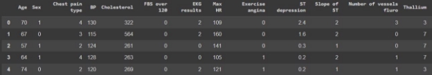

Fig 3.1 Data before Normalisation

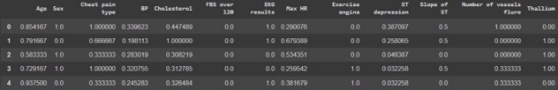

Fig. 3.2 Data after Normalisation

4. **Algorithms and Techniques**
1. **K-Fold Cross Validation**

K-Fold Cross validation is a technique that is used for evaluating the performance of a model, and provides a way to deal with data variability.

It divides the data into ‘K’ folds, that are non-overlapping subsets of the whole training data.

The performance of the model is evaluated iteratively across all the folds.

At each iteration, one fold is used for validation, while the rest are used for training.

At the end of this process, the performance metrics across all the iterations are averaged. This allows for a more reliable estimate of the model generalisation performance.

Compared to a single Test-split, this method allows for more accurate and stable evaluation of the model’s performance.

This technique is often used for Hyperparameter Tuning and selecting the best model, and for identifying flaws like overfitting in the model.

2. **Stratified K-Fold Cross Validation**

This version of K-fold cross validation is similar to the original, but makes an adjustment for a certain case, that is, class imbalance.

In the case of a target class imbalance, using Stratified K-Fold Cross validation will ensure that all of the folds are segmented with a target class ratio that is equal to that of the original dataset.

In our case, our data is imbalanced, so we utilised this technique to evaluate our models and tune the hyperparameters.

The fraction of positive test cases, i.e. ‘Heart Disease’==’Absence’, in the original dataset is 55.55%, corresponding to 150 out of 270 total rows.

This ratio of 55.55% will be maintained across all the folds generated.

3. **Grid-Search**

This function is part of the ‘sci-kit’ and ‘sklearn’ module, and is used primarily, in our case, for hyperparameter tuning of the models.

It consists of passing a grid of hyperparameters, in the form of a dictionary, and the algorithm will evaluate a model using all the permutations of the hyperparameters passed, and will return the best performing model, along with the best performing values of the hyperparameters passed.

The evaluation is performed using K-fold cross validation by default.

The evaluation metrics can also be passed to the GridSearchCV function.

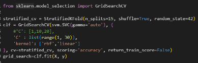

Fig. 4 Using GridSearchCV for tuning hyperparameters ‘C’ and ‘kernel’ of SVM.

**The above techniques are common across all the following models used:**

4. **K-Nearest Neighbours**

K-nearest neighbour algorithm (KNN) works on the principle of similarity.

A set number of “neighbours” of the testing data point are identified by evaluating the distance vectors from the testing data point to each of the training data points.

The closest K neighbours are identified, and through a majority vote or an average of their target class value, the target class value of the test point is predicted.

The algorithm is simple yet powerful, but also computationally expensive for large volumes of data. And as the dimensions of the data increase, the distance approaches uniformity across the samples,

5. **Support vector Machine**

Support Vector Machine (SVM) works by finding the best possible hyperplane in the feature space to separate the data points of different classes, by maximising the margin from the points closest to the hypothetical hyperplane. The model can handle linear as well as non-linear data of high dimensionalities using different kernel functions.

6. **Random Forest**

Random forest is an ensemble of decision trees that is aimed at achieving stable and reliable predictions. The decision trees are trained on random subsets of the data, with random subsets of features, reducing the risk of overfitting and providing stable estimates of performance metrics.

It aggregates the predictions of all the estimators and so results in a model that is robust and resistant to outliers and noise.

7. **Logistic Regression**

Logistic regression is a classification algorithm that maps a binary dependent variable (in our case, ‘Heart Disease’ feature) to one or more independent features through a logistic/sigmoidal function.

It first calculates a probability score through a linear combination of the input features and which is converted into a binary outcome prediction.

8. **AdaBoost**

AdaBoost is another ensemble technique that aims to enhance the predictive capabilities of multiple weak learning models to create a robust and accurate ensemble model.

This is achieved by identifying which cases were misclassified by the weak learners (usually taken to be decision trees with limited depth), and assigns higher weightage to those cases. This way, it is able to reduce the errors generated by the weak learning models across iterations, and finally aggregates the predictions of the boosted weak learners to achieve highly accurate results.

In the experiment, we used the default base estimator, that is, a Decision tree with maximum depth of 1.

3. **RESULT ANALYSIS (Using Original Target Class composition)**
1. **K-NN**

The best performing model found through GridSearch and Stratified K-fold cross validation was a KNN model with the following hyperparameters:

*'algorithm': 'auto' 'metric': 'minkowski' 'n\_neighbors': 38 'p': 1*

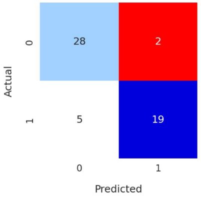

**Fig. 5.1** Confusion matrix of KNN classifier on test data

![ref1]

**Fig. 5.2** Performance evaluation of KNN classifier on test data

2. **SVM**

The best performing model found through GridSearch and Stratified K-fold cross validation was a SVM model with the following hyperparameters:

*C: 0.02*

*Kernel: linear*

*class weights: {'Absence': 0.9, 'Presence': 1.125}*

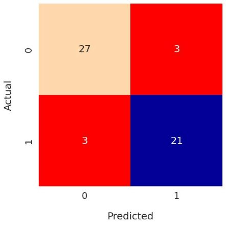

**Fig. 6.1** Confusion matrix of SVM classifier on test data

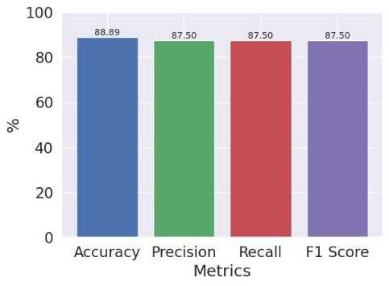

**Fig. 6.2** Performance evaluation of SVM classifier on test data

3. **Random Forest**

The best performing model found through GridSearch and Stratified K-fold cross validation was a Random Forest Classifier model with the following hyperparameters:

*n\_estimators: 50 max\_depth: 3*

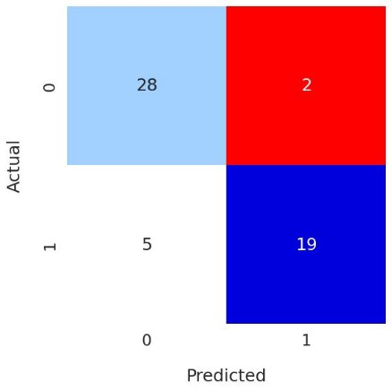

**Fig. 7.1** Confusion matrix of Random Forest classifier on test data

![ref2]

**Fig. 7.2** Performance evaluation of Random forest classifier on test data

4. **Logistic Regression**

The best performing model found through GridSearch and Stratified K-fold cross validation was a Logistic Regression model with the following hyperparameters:

*C: 1          penalty: l2     solver: liblinear*

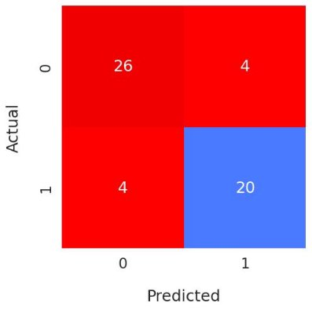

**Fig. 8.1** Confusion matrix of Logistic regression on test data

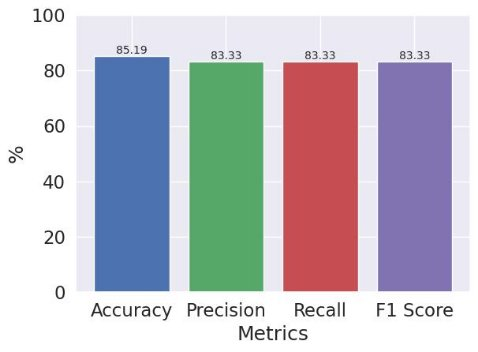

**Fig. 8.2** Performance evaluation of Logistic regression on test data

5. **AdaBoost**

The best performing model found through GridSearch and Stratified K-fold cross validation was a model with the following hyperparameters:

*estimator: DecisionTreeClassifier n\_estimators: 100*

*learning rate: 0.05*

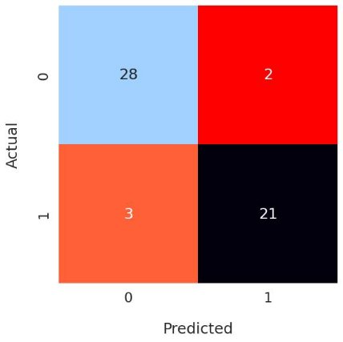

**Fig. 9.1** Confusion matrix of AdaBoost on test data

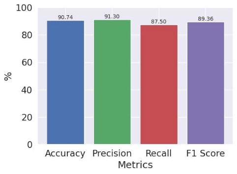

**Fig. 9.2** Performance evaluation of Adaboost classifier on test data

**3.B. RESULT ANALYSIS (Using balanced subset of original dataset) 3.B.1. KNN**

6. **COMPARATIVE ANALYSIS**

The results across the algorithms with respect to the various metrics are illustrated as follows.

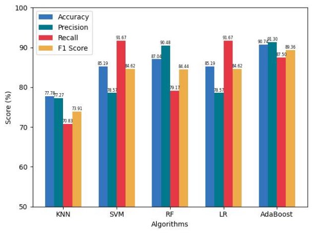

**Fig. 10.1** Comparing the algorithms with respect to performance metrics

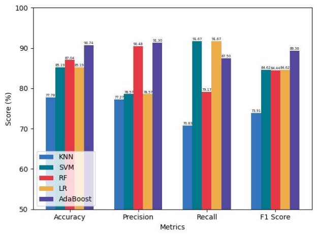

**Fig. 10.2** Alternate representation of Fig. 10.1

7. **CONCLUSION**

This project has described the work done on the problem statement of prediction of Heart disease in patients through classification by various machine learning algorithms, and the techniques it entails. The study was performed on the Heart disease dataset [2].

The techniques used included K-Nearest neighbours, Support vector machine, Random forest, Logistic regression and AdaBoost with decision tree as base estimator.

The best performing model in this particular experiment was the AdaBoost, with an accuracy of 90.74%, with Precision, Recall and F1 scores as 91.30%, 87.50%, 89.36% respectively.

The Hyperparameter tuning of each algorithm was done using GridSearchCV using Stratified K-Fold Cross Validation.

The dataset has a large number of features, with complex relationships, therefore, to increase

accuracy by recognising complex patterns, a higher volume of data is required, which was unable to be fulfilled in the described experiment.

Further tuning can also help increase the accuracy of the models.

8. **BIBLIOGRAPHY**
- [1] UCI dataset: [https://www.semanticscholar.org/paper/International-application-of-a-new-probability-for-Detrano-J %C3%A1nosi/a7d714f8f87bfc41351eb5ae1e5472f0ebbe0574](https://www.semanticscholar.org/paper/International-application-of-a-new-probability-for-Detrano-J%C3%A1nosi/a7d714f8f87bfc41351eb5ae1e5472f0ebbe0574)
- [2] Kaggle dataset: [https://www.kaggle.com/datasets/rishidamarla/heart-disease-prediction?datasetId=841679&sortBy=v oteCount](https://www.kaggle.com/datasets/rishidamarla/heart-disease-prediction?datasetId=841679&sortBy=voteCount)
- Documentation <https://scikit-learn.org/stable/>
- GeeksForGeeks (tips) <https://www.geeksforgeeks.org/>
- Analytics Vidhya (tips) <https://www.analyticsvidhya.com/blog/2021/04/steps-to-complete-a-machine-learning-project/>
- Pandas documentation <https://pandas.pydata.org/docs/>
- MachineLearningMastery (tips) <https://machinelearningmastery.com/>
- Examples <https://github.com/codebasics/py>

[ref1]: images/Aspose.Words.2bc31c3c-c419-4e3d-a0c4-e24ae8022577.008.jpeg
[ref2]: images/Aspose.Words.2bc31c3c-c419-4e3d-a0c4-e24ae8022577.012.jpeg
